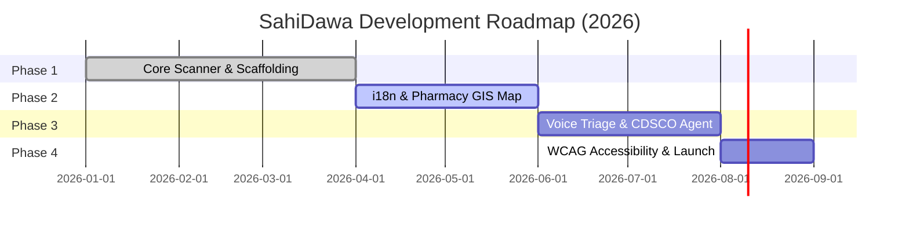

# SahiDawa — Unified Architecture & Project Context

> **Single source of truth.** Read this first before making ANY code change.  
> Last updated: May 2026 | Codebase version: MVP Phase 1 (post-PR #511 Integration)

---

## 1. Vision & Core Value Proposition

**SahiDawa** ("Sahi Dawa" = _Correct Medicine_ in Hindi) is **India's first open-source citizen medicine verification platform**. It is designed to solve three critical, intersecting healthcare challenges in India simultaneously:

1. **Fake & Counterfeit Medicines** — Studies estimate that 12% to 25% of medicines distributed in India are counterfeit. Currently, no public, citizen-facing verification system exists for checking drug authenticity.
2. **Rural Healthcare Gaps** — Over 65% of India's population resides in rural areas, where professional doctors and diagnostic resources are severely limited or entirely absent.
3. **Language Barriers** — India has 22 official regional languages, yet almost all healthcare applications and packaging information are available exclusively in English.

**Core Target User:** A rural Indian citizen, local health volunteer (ASHA worker), or NGO coordinator who wants to verify a medicine strip's authenticity before ingestion, seek basic symptom triage advice, and locate certified pharmacies or health agents nearby.

**Key Operating Principles:**

- **Free Forever:** No advertising, no monetization of patient data, and no paid API paywalls in the critical path.
- **Works on 2G / Offline-First:** Highly optimized, lightweight pages and on-device processing to ensure usability under low-bandwidth networks.
- **Community & Open Source:** Powered by crowd-sourced counterfeit reports, open-source components, and government data integration.

---

## 2. Core User Flows

The application orchestrates three major user journeys designed to be resilient, highly localized, and accessible:

```
Flow 1 — Scan, OCR & Verify (Offline-Capable)
  User scans barcode/QR or uploads medicine image
  → On-device ZXing scanner parses barcode or Tesseract OCR extracts text
  → The system identifies Batch Number, Expiry Date, and Brand Name
  → REST API queries Supabase 'medicines' catalog
  → Returns: REAL ✅ / SUSPICIOUS ⚠️ / FAKE ❌ + counterfeit alert flags

Flow 2 — Multilingual Voice Health Triage
  User records symptom descriptions in local language (Hindi, Tamil, Marathi, etc.)
  → ML service transcribes audio using Whisper ASR with regional language hints
  → Indian LLM (Sarvam AI) via LangChain processes user intent in native language
  → Returns: Standard triage classification, guidance, and nearest clinic recommendations

Flow 3 — Trusted Pharmacy Map
  User views location map
  → GIS query searches nearest verified Jan Aushadhi generic drugstores & ASHA workers
  → Leaflet.js maps pins dynamically on OpenStreetMap
  → Returns: Fully searchable list, directions, and direct call actions
```

---

## 3. Monorepo Architecture

SahiDawa is structured as a monorepo utilizing **NPM Workspaces** to ensure clear separation of concerns, high modularity, and simplified local development.

### Workspace Directory Layout

```
sahidawa-india/                 ← Repository Root (always execute workspace commands here)
├── apps/
│   ├── web/                    ← Next.js 16 Client Frontend (Port 3000)
│   │   ├── app/                ← App Router pages and localization
│   │   │   ├── [locale]/       ← Dynamic locale routes (i18n wrapper)
│   │   │   │   ├── scan/       ← Client-side Medicine Scanner page
│   │   │   │   ├── voice/      ← Voice triage recording and panels
│   │   │   │   └── map/        ← Pharmacy locator map
│   │   ├── components/         ← Reusable UI and visualization components
│   │   ├── lib/                ← API client utilities and wrappers
│   │   ├── messages/           ← Regional i18n translation bundles (JSON)
│   │   └── src/utils/          ← Frontend utilities (e.g. medicine parser logic)
│   │
│   ├── api/                    ← Express 5 Core API Backend (Port 4000)
│   │   └── src/
│   │       ├── db/             ← Database setup (Supabase client & migrations)
│   │       ├── routes/         ← API routes (verify, pharmacies, reports)
│   │       ├── services/       ← Database queries and cache managers
│   │       └── middleware/     ← Security headers, rate limiting, and input validator
│   │
│   └── ml/                     ← Python FastAPI ML Microservice (Port 8000)
│       ├── main.py             ← ML API gateway configuration
│       ├── routers/            ← ML routes (whisper ASR, pytesseract OCR)
│       ├── services/           ← Whisper engine, LangChain models, and embeddings
│       ├── models/             ← Quantized ONNX / TF Lite files for local inference
│       └── agent/              ← Scraping agent for CDSCO portal recall monitoring
│
├── packages/                   ← Shared library workspaces (reserved for common types/schemas)
├── data/
│   └── seeds/                  ← Central CDSCO and Jan Aushadhi datasets (CSV/SQL seeds)
└── docs/                       ← Developer setup and contribution guides
```

### High-Level System Data Flow

```mermaid
flowchart TD
    U[User (Patient/Rural Citizen)] -->|Scan Barcode/Voice| Web[Next.js PWA Client]
    Web -->|API call (REST)| API[Node.js/Express API]
    API -->|Query/Verify| DB[(Supabase PostgreSQL)]
    API -->|Cache Lookup| Cache[(Redis Cache)]
    Web -->|Upload Image/Voice| ML[Python FastAPI (ML Service)]
    ML -->|Voice ASR| Whisper[Whisper ASR]
    ML -->|Image Classifier| CV[OpenCV / TF Lite]
    ML -->|Triage Q&A| LLM[Sarvam AI / LangChain]
    LLM -->|Send Answer| API
    Poller[LangChain CDSCO Poller] -->|Fetch Recalls| CDSCO[CDSCO Drug Portal]
    Poller -->|Update Database| DB
```

---

## 4. Current Build & Integration Status

Below is the implementation status of key system modules:

| **Component / Module**                | **Primary Code Location**              | **Status**    | **Description / Technical Notes**                                                                                                                                                                                                                                                             |
| :------------------------------------ | :------------------------------------- | :------------ | :-------------------------------------------------------------------------------------------------------------------------------------------------------------------------------------------------------------------------------------------------------------------------------------------- |
| **Home Dashboard**                    | `apps/web/app/[locale]/page.tsx`       | ✅ Completed  | Static premium home dashboard with clear navigation cards and dark mode overlays.                                                                                                                                                                                                             |
| **Medicine Scanner & OCR**            | `apps/web/app/[locale]/scan/page.tsx`  | ✅ Completed  | Fully client-side offline scanner. Integrates ZXing for live barcode extraction and Tesseract.js with memory-safe web-worker lifecycles for high-performance offline OCR text extraction. Supported by the regex parser utility (`apps/web/src/utils/medicineParser.ts`) and Jest test suite. |
| **Voice Assistant**                   | `apps/web/app/[locale]/voice/page.tsx` | ✅ Completed  | Implements microphone stream recording, connects to FastAPI's Whisper ASR endpoints, and features seamless browser speech recognition fallbacks.                                                                                                                                              |
| **Pharmacy & ASHA Map**               | `apps/web/app/[locale]/map/page.tsx`   | 🚧 UI Mock    | Styled map panel displaying mock location pins. OpenStreetMap + Leaflet integration is scheduled for Phase 2.                                                                                                                                                                                 |
| **Custom Error & Loading boundaries** | `apps/web/app/[locale]/error.tsx`      | ❌ Pending    | App-wide standard boundaries templates are empty.                                                                                                                                                                                                                                             |
| **Supabase DB Client**                | `apps/api/src/db/client.ts`            | ✅ Completed  | Client singleton initialized with service role and public anon credentials. Ready for database routing.                                                                                                                                                                                       |
| **Express Server Gateway**            | `apps/api/src/index.ts`                | ✅ Scaffolded | HTTP gateway configured. Standard `/health` route is live. Service controllers are to be integrated.                                                                                                                                                                                          |
| **Core API Routes & Services**        | `apps/api/src/routes/`                 | ❌ Pending    | Verification endpoints (`/verify`), reports ingestion (`/reports`), and geolocator APIs are under construction.                                                                                                                                                                               |
| **FastAPI ML Gateway**                | `apps/ml/main.py`                      | ✅ Completed  | ML gateway configured. Runs CORS middlewares and supports startup preloading of standard transcription models.                                                                                                                                                                                |
| **Regional Voice ASR Route**          | `apps/ml/routers/asr.py`               | ✅ Completed  | Faster-Whisper integration. Features FFmpeg audio track normalization, audio down-sampling, and customizable language hints (e.g. `hi`, `ta`).                                                                                                                                                |
| **OCR Fallback API**                  | `apps/ml/routers/ocr.py`               | ❌ Pending    | Image text extraction gateway utilizing `pytesseract`. Client-side Tesseract.js fallback serves as primary verifier.                                                                                                                                                                          |
| **GIS Pharmacy Data Schema**          | `apps/api/src/db/schema.sql`           | ✅ Completed  | Comprehensive Postgres schema with PostGIS spatial indices (`location POINT`) and pgvector hooks. CDSCO generic dataset migrations are pending.                                                                                                                                               |
| **Redis Cache Layer**                 | `apps/api/src/db/cache.ts`             | ✅ Configured | Upstash Redis SDK dependencies added; integration into API route controllers is scheduled for Phase 2.                                                                                                                                                                                        |
| **Offline PWA Worker**                | `apps/web/public/sw.js`                | 🚧 Planned    | Workbox static precaching and offline navigation handlers are drafted but unintegrated.                                                                                                                                                                                                       |
| **Documentation & i18n**              | `apps/web/messages/`                   | 🚧 Partial    | Dynamic Next-Intl pipeline is configured. English translations are completed. Remaining 21 regional languages are skeleton folders.                                                                                                                                                           |

---

## 5. Technology Stack & Dependencies

The SahiDawa infrastructure uses precise, modernized versions to guarantee security, modularity, and speed. **Do not downgrade these packages during contributions.**

### Client Frontend (`apps/web`)

- **Next.js 16** (`^16.2.4`) — App Router, dynamic server rendering, and prefetching.
- **React 19** (`^19.2.5`) — Native transitions, async actions, and ref-based lifecycle control.
- **Tailwind CSS 4** (`^4.2.4`) — Integrated with `@tailwindcss/postcss`. _Note: Tailwind v4 relies on CSS `@theme` tokens in `globals.css` rather than a `tailwind.config.js` file._
- **ZXing Browser** (`^0.11.0`) — Native multi-format barcode and QR code decoding.
- **Tesseract.js** (`^5.1.0`) — Multilingual, pure JS optical character recognition running inside independent Web Workers to avoid main-thread blocks.
- **Lucide React** (`^1.14.0`) — Sleek vector iconography.
- **TypeScript** (`^6.0.3`) — Static typing and compiler validations.

### API Backend (`apps/api`)

- **Node.js 22+** (LTS release)
- **Express 5** (`^5.0.0`) — Modernized middleware, promise-rejection capturing, and native route optimizations.
- **@supabase/supabase-js** (`^2.105.3`) — Client SDK for query execution, authentication management, and file storage.
- **TypeScript** (`^5.5.0`) + **ts-node-dev** — Hot-reloaded TypeScript compiler for dev server.

### ML Microservice (`apps/ml`)

- **Python 3.12+**
- **FastAPI** (`>=0.115.0`) — High-performance ASGI framework with auto-generated OpenAPI documentation.
- **Faster-Whisper** (`^1.0.0`) — Re-implementation of OpenAI's Whisper model utilizing CTranslate2, delivering up to 4x speed increases and reduced memory footprint.
- **Pydantic v2** (`>=2.9.0`) — Fast schema validation and serialization.
- **Uvicorn** — Ultra-fast ASGI web server implementation.

### Datastore & Cache

- **PostgreSQL (Supabase)** — Primary relational engine.
- **PostGIS Extension** — Geospatial analysis tools for coordinate indexing and spatial polygon matches.
- **pgvector Extension** — Local multi-dimensional vector storage to enable future RAG workflows.
- **Upstash Redis** — Fully managed cache cluster.

---

## 6. Environment Configuration

The application reads the following variables from the environment. Ensure these are defined in your local `.env` files (refer to `.env.example` at root):

| **Variable Key**            | **Target Scope** | **Security Level** | **Description / Purpose**                                              |
| :-------------------------- | :--------------- | :----------------- | :--------------------------------------------------------------------- |
| `SUPABASE_URL`              | Root / API       | Public             | The endpoint URL of your managed Supabase instance.                    |
| `SUPABASE_ANON_KEY`         | Root / Web / API | Public             | The public anonymous key. Safe for browser exposure.                   |
| `SUPABASE_SERVICE_ROLE_KEY` | Root / API       | **Server-Only**    | Admin bypass key. **Never expose to client or frontend code!**         |
| `PORT`                      | API              | Configurable       | Local port designation for Express gateway (Defaults to `4000`).       |
| `ML_PORT`                   | ML               | Configurable       | Local port designation for Python FastAPI (Defaults to `8000`).        |
| `REDIS_URL`                 | API              | **Server-Only**    | Redis connection URI for caching medicine catalog records.             |
| `CLOUDINARY_URL`            | Web / API        | **Server-Only**    | Media uploads target for storing uploaded counterfeit medicine images. |
| `SARVAM_API_KEY`            | ML               | **Server-Only**    | Indian LLM engine API token for localized voice triaging.              |

---

## 7. Workspace Development Commands

To ensure packages are resolved correctly and dependencies remain centralized, **always run NPM commands from the repository root**. Never `cd` into sub-folders to run `npm install`.

```bash
# 1. Install all dependencies across all monorepo workspaces
npm install

# 2. Run the Next.js frontend in development mode
npm run dev -w web            # Serves local frontend on http://localhost:3000

# 3. Run the Express API gateway in development mode
npm run dev -w api            # Serves local backend on http://localhost:4000

# 4. Install a new dependency in a specific workspace
npm install <pkg_name> -w web   # Installs only inside Next.js client
npm install <pkg_name> -w api   # Installs only inside Express backend

# 5. Run standard Jest unit test suites
npm run test -w web           # Executes frontend Jest unit test files
```

---

## 8. Tailwind v4 Design Tokens

SahiDawa is designed with a premium, accessible, and high-performance dark/light interface. Colors and dimensions are standardized as theme tokens:

- **Brand Accent Palette:** Emerald Green (`emerald-500` / `#10b981`, `emerald-400`, `emerald-600`). Represents trust, medical validation, and safety.
- **Canvas Backgrounds:**
    - **Slate Light (`slate-50`):** Applied across global landing grids, navigation portals, and pharmacy maps to ensure readability under direct sunlight.
    - **Absolute Pitch Black (`black` / `slate-900`):** Applied exclusively in camera scanners (`/scan`) and audio triage screens (`/voice`) to focus visual attention, save battery life on AMOLED screens, and maximize contrast.
- **Borders & Seams:** Transparent white lines (`white/10`) on dark interfaces, and crisp light gray (`slate-200`) on light dashboards.
- **Typography:** System Sans-Serif stack styled with fluid leading dimensions.
- **Card Roundedness:** Smooth, modern shapes utilizing outer boundaries of `rounded-2xl` up to `rounded-[2.5rem]`.

> **Tailwind v4 Transition Alert:** SahiDawa uses Tailwind v4. Legacy syntax rules are deprecated:
>
> - Use `bg-linear-to-b` instead of the legacy `bg-gradient-to-b`.
> - Use `bg-size-[value]` instead of the arbitrary bracket notation `bg-[size:value]`.

---

## 9. Development Phase Roadmap

Development is split into distinct milestones designed to stabilize core infrastructure before layering specialized AI/ML workflows:



### Key Milestones

- **Phase 1: Pre-GSSoC Core Infrastructure (Completed)**
    - Scaffold Next.js client, Express REST core, and FastAPI ML microservices.
    - Establish PostGIS geospatial and relational database schemas in Supabase.
    - Implement fully functioning on-device medicine scanning with ZXing + Tesseract.js OCR fallbacks.
- **Phase 2: Localization, Storage & Maps (Current Focus)**
    - Embed interactive Leaflet mapping linked to live PostGIS coordinate searches.
    - Seed local pharmacy data (Jan Aushadhi database).
    - Integrate Cloudinary API pipelines for storing verified counterfeit medicine image uploads.
    - Translate UI strings across 22 regional Indian languages utilizing Next-Intl routing.
- **Phase 3: Multilingual Voice & Ingestion Pipelines (Scheduled)**
    - Hook Whisper ASR routing to FastAPI endpoints with regional language down-sampling.
    - Integrate LangChain autonomous CDSCO alert scrapers to automatically flag new recalled drugs.
    - Deploy Sarvam AI LLM routing to answer native audio queries.
- **Phase 4: Audits, Dockerization & Public Deployment (Scheduled)**
    - Complete full WCAG 2.2 accessibility standard checks (screen readers, color contrast).
    - Build orchestrations using local Docker Compose setups.
    - Execute public mainnet hosting deployments.

---

## 10. Key Engineering Constraints

1. **Free & Sovereign API Paths:** Never implement paid, third-party medical API layers. All critical core steps (ASR transcription, optical text scanning, GIS mapping) must remain free and open-source (e.g. self-hosted Whisper engines, on-device OCR, OpenStreetMap).
2. **2G Network Resiliency:** Minimize overall client bundle footprint. Utilize server components where applicable, lazy-load heavy sub-packages (e.g. Web Workers for Tesseract.js), and optimize PWA caching strategies.
3. **No Hoisting Violations:** Never execute local package installs (like `cd apps/web && npm install`). Run all dependency injections from the root directory using the `-w` workspace directive to maintain clean hoist configurations.
4. **Service Keys Safety:** The `SUPABASE_SERVICE_ROLE_KEY` bypasses all Row-Level Security policies. **Never commit, output, or pass this variable inside any client-side frontend code.** Keep it strictly locked in backend API server scopes.
5. **Tailwind v4 Strict Theme Compliance:** Do not introduce a `tailwind.config.js` file. Custom color rules, fonts, and animation properties must be declared as CSS custom properties under `@theme` inside `apps/web/app/globals.css`.
